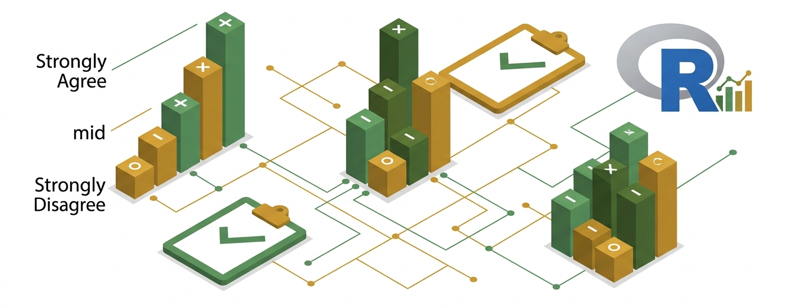

::: {.column-page-centered}
{fig-align="center"}
:::

<!-- 
 -->
<!--   <a href="full-course.pdf" download class="btn btn-danger btn-lg"> -->
<!--     <i class="bi bi-file-earmark-pdf-fill"></i> Download Full Course PDF -->
<!--   </a> -->
<!-- 
 -->

<h1>Description of the course</h1>

Surveys are key tools for measuring human perceptions, capturing latent traits through structured responses.
Among the data they generate, ordinal and rating data are particularly important yet often less studied, requiring specialized statistical techniques.
Ordinal data appears frequently in real-world applications, such as customer satisfaction surveys, psychological assessments, and medical research, making its correct analysis crucial for obtaining reliable insights.
This short course provides instructor-led, hands-on training in the analysis of ordinal data.
It begins with an overview of survey design and the validation of results, focusing on building effective surveys and ensuring the reliability of the data obtained.
The course then covers the most commonly used statistical models for analyzing ordinal data, with an emphasis on discovering latent patterns and traits.
Both theoretical foundations and practical applications will be explored, using real-world case studies from domains such as marketing, social sciences, tourism and culture.

A common approach to analyzing ordinal data is to treat it as numerical, but this can lead to a loss of statistical power.
In this course, participants will learn how to apply specialized methods designed for ordinal data, allowing them to draw more effective and reliable conclusions.

<h1>Objectives of the course</h1>

By the end of the course, participants will have both theoretical knowledge and practical skills to analyze ordinal data in research and professional settings.
Specifically, they will be able to:

-   Understand what ordinal data is, how it differs from other types of data, and the challenges involved in its analysis
-   Compute and interpret reliability and validity measures
-   Fit proportional odds models in R and interpret the results
-   Analyse rating data by applying CUB models

 

## Course modules

::: {.list-group}
[**1. Introduction to Ordinal Data and Survey Design**](01-introduction.qmd){.list-group-item .list-group-item-action}
Overview of ordinal data characteristics, survey design principles, and data visualization techniques.

[**2. Classical Models for Ordinal Data**](02-ordinal-models.qmd){.list-group-item .list-group-item-action}
In-depth analysis of Cumulative Link Models (CLM) and proportional odds, with applied case studies.

[**3. Beyond Standard Approaches: CUB Models**](03-CUB.qmd){.list-group-item .list-group-item-action}
Exploring CUB models to measure latent traits, separating respondents' feelings from uncertainty.

[**4. Models for Multivariate Ordinal Data**](04-multivariate.qmd){.list-group-item .list-group-item-action}
Advanced techniques for analyzing multivariate ordinal variables and clustering methods.
:::